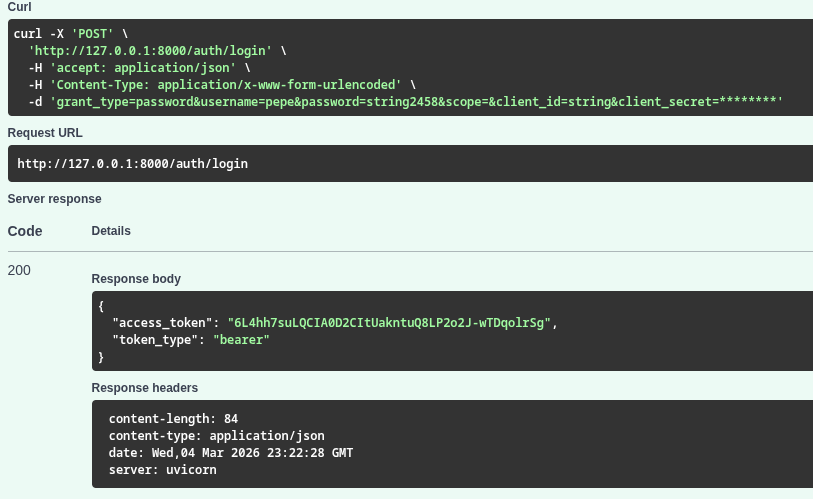
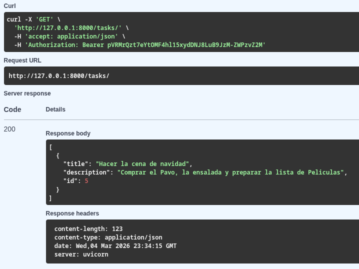

# Secure Task API
Una API RESTful para la gestión de tareas con autenticación y autorización, implementando las mejores prácticas de seguridad, incluyendo hashing de contraseña ultra seguro (argon32), y autenticación vía tokens de sesión.

## Tecnologías
1. **Framework**: FastAPI
2. **ORM**: SQLAlchemy
3. **Seguridad**: Pwdlib (argon32) para hashing 
4. **Validación**: Pydantic para esquemas y tipado de datos

## Arquitectura del Proyecto
Se ha adoptado una arquitectura de software MVC o Model Vista Controlador al desarrollo de la API REST

### Flujo de Datos

<!-- Agregar imagen del flujo de datos aquí -->

### Base de Datos Relacional

<!-- Agregar imagen del diagrama de base de datos aquí -->

## Endpoints

| Método | Ruta | Descripción | Autenticación |
|--------|------|-------------|---------------|
| POST | `/auth/register` | Registrar un usuario nuevo | ❌ No |
| POST | `/auth/login` | Iniciar sesión y obtener token | ❌ No |
| POST | `/tasks/` | Crear una tarea | ✅ Bearer Token |
| GET | `/tasks/` | Listar mis tareas | ✅ Bearer Token |
| PUT | `/tasks/{id}` | Actualizar una tarea | ✅ Bearer Token |
| DELETE | `/tasks/{id}` | Eliminar una tarea | ✅ Bearer Token |

## Estructura del Proyecto

```
secure_task_api/
├── app/
│   ├── main.py             # Arranque de la API
│   ├── database.py         # SQLAlchemy config de la sesión y la conexión con la db
│   ├── models/             # M: Modelos de DB (tablas mapeadas con SQLAlchemy)
│   ├── views/              # V: Pydantic Schemas
│   ├── controllers/        # C: Rutas y Lógica
│   └── utils/              # Hashing y Seguridad
├── .env                    # Secretos
└── pyproject.toml          # Dependencias y configuración del proyecto (uv)
```

### app/
Contiene el arranque de la API con FastAPI y el gestor de conexiones a través del ORM SQLAlchemy. Principalmente en dos archivos diferentes.

### models/
Contiene los modelos u objetos (que representan tablas con columnas) que serán mapeados con SQLAlchemy para crear la bd y sus relaciones. Contiene las tablas y sus relaciones uno a muchos:
1. users
2. task
3. tokens

### views/
Contiene los schemas que son el equivalente a las vistas, pues muestran cómo se van a salir los datos o información mediantes estos moldes costruidos con pydantic.

### utils/
Contiene el núcleo central de seguridad para hashear las contraseñas de cada usuario.

## Cómo instalar y ejecutar

1. Clona el repositorio:
```bash
git clone https://github.com/tu-usuario/SecureTask-API.git
```

2. Entra al directorio del proyecto:
```bash
cd SecureTask-API
```

3. Instala las dependencias con uv (crea el entorno virtual automáticamente):
```bash
uv sync
```

4. Ejecuta la API en modo desarrollo:
```bash
uv run fastapi dev app/main.py
```

5. Abre la documentación interactiva en tu navegador:
   - Swagger UI: `http://127.0.0.1:8000/docs`
   - ReDoc: `http://127.0.0.1:8000/redoc`

## Ejemplo de uso
<details>
  <summary>Haz clic para ver las capturas de Swagger</summary>
  
  
</details>

## Mejoras para el aprendizaje
  - Despliegue en Railway y hacer migracion a PostgreSQL
  - Implementar Docker
  - Implementar una Feature nueva
## Contacto

- **GitHub:** [richiechz-dev](https://github.com/richiechz-dev)
- **LinkedIn:** [Ricardo Chavez](https://www.linkedin.com/in/ricardochz/)
- **Email:** gic.rc455@gmail.com